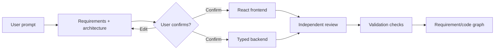

# ForgeWeb

ForgeWeb is an architecture-first, full-stack application generator. A user describes a product, reviews the generated requirements and `ARCHITECTURE.md`, explicitly confirms the plan, and only then does ForgeWeb generate the customer's React frontend and typed backend.


## Generated application preview

ForgeWeb now produces a complete responsive customer-application surface rather than a placeholder hero.


## What works today

- Prompt-to-requirements compilation with stable requirement IDs.
- Prompt-specific architecture covering frontend, backend, data, security, delivery, and system boundaries.
- A hard `awaiting_confirmation` gate: no source files exist before approval.
- Real LLM generation through a provider abstraction (local Ollama or any OpenAI-compatible endpoint), configured entirely by environment variables.
- A deterministic template path that transparently takes over whenever no provider is reachable, so the workflow never stalls and never ships unparsed model output.
- React and TypeScript customer-application generation.
- Typed Node.js backend contracts, role/ownership policy, and audit envelopes.
- Customer-app capability planning for React, Git, GSAP, Anime.js, and reviewed React Bits patterns.
- Karpathy-derived coding discipline and gstack-informed bounded specialist tasks.
- Independent scope and traceability review, combining a deterministic gate with advisory model findings.
- Deterministic validation and a requirement evidence graph that links every requirement to the files implementing it and the checks that inspected those files, with unrunnable checks reported as skipped rather than passed.
- Persistent local projects, immutable version snapshots, and safe restore in an atomic JSON store.
- A real sandboxed professional application preview generated from the approved specification, with centered navigation, dashboard surfaces, and desktop/tablet/mobile controls.
- Automatic, validated compatibility upgrades for older saved projects that predate frontend previews or the current project layout.
- Prompt-scoped project edits that validate before creating a new version and preserve the last working version on failure.
- Generated-application database information kept separate from ForgeWeb's control-plane storage.
- Validation-gated ZIP export containing the actual files from the selected project version.
- Responsive animated ForgeWeb interface with reduced-motion behavior.

## Generation flow



The confirmation boundary is enforced by the backend state machine. It is not merely a disabled frontend button.

## Technology

| Area | Technology |
|---|---|
| Platform UI | React 19, TypeScript, Vite, Tailwind CSS |
| Motion | GSAP, Anime.js, Motion, Three.js/OGL |
| Control plane | Node.js, TypeScript, native HTTP server |
| Persistence | Atomic local JSON store |
| Validation | Node test runner, TypeScript, custom UI audit with Playwright |
| Generated apps | React/TypeScript frontend and typed Node.js backend artifacts |

## Requirements

- Node.js 22 or newer
- pnpm 10 or newer
- Google Chrome only when running the optional visual UI audit

If pnpm is not installed:

```powershell
corepack enable
corepack prepare pnpm@latest --activate
```

## Quick start

```powershell
git clone https://github.com/Sachin71000/forgeweb.git
cd forgeweb
pnpm install
pnpm dev
```

Open [http://127.0.0.1:5173](http://127.0.0.1:5173).

`pnpm dev` starts both the Vite frontend and the local ForgeWeb API. A second terminal is not required.

## AI provider configuration

ForgeWeb reads every provider setting from the environment. No key, URL, or model name is hardcoded, and none is ever returned by the API. Copy the committed template and edit it:

```powershell
Copy-Item .env.example .env
```

`.env` is gitignored. Real environment variables take precedence over the file, and the file takes precedence over the built-in defaults, so `FORGEWEB_LLM_ENABLED=false pnpm test` always wins over local configuration.

| Variable | Alias | Default | Purpose |
|---|---|---|---|
| `FORGEWEB_LLM_PROVIDER` | `LLM_PROVIDER` | `ollama` | `ollama` or `openai-compatible`. Gateway names such as `openai`, `openrouter`, `groq`, `together`, `agentrouter`, and `lmstudio` are accepted aliases for `openai-compatible`. |
| `FORGEWEB_LLM_MODEL` | `LLM_MODEL` | `qwen2.5-coder:7b-instruct` | Model identifier. Defaults to `gpt-4o-mini` for OpenAI-compatible providers. |
| `FORGEWEB_LLM_BASE_URL` | `LLM_BASE_URL` | `http://127.0.0.1:11434` | API base URL. Defaults to `http://127.0.0.1:1234/v1` for OpenAI-compatible providers. |
| `FORGEWEB_LLM_API_KEY` | `LLM_API_KEY` | empty | Key for hosted gateways. Leave empty for local Ollama and LM Studio. |
| `FORGEWEB_LLM_TEMPERATURE` | `LLM_TEMPERATURE` | `0.1` | Sampling temperature, clamped to 0.0–2.0. |
| `FORGEWEB_LLM_MAX_TOKENS` | `LLM_MAX_TOKENS` | `4096` | Maximum output tokens, minimum 256. |
| `FORGEWEB_LLM_TIMEOUT_MS` | `LLM_TIMEOUT_MS` | `120000` | Per-request timeout, minimum 5000. Raise it for small models on CPU. |
| `FORGEWEB_LLM_ENABLED` | `LLM_ENABLED` | `true` | Set to `false` to use only deterministic template generation. |
| `FORGEWEB_API_PORT` | — | `8787` | Port for the standalone API. |
| `FORGEWEB_DATA_DIR` | — | `.forgeweb-data` | Location of the local JSON store. |
| `FORGEWEB_ENV_FILE` | — | `.env` | Alternate environment file to load. |

Local generation with Ollama:

```powershell
ollama pull qwen2.5-coder:7b-instruct
ollama serve
```

A hosted OpenAI-compatible gateway instead:

```powershell
$env:LLM_PROVIDER = "openai-compatible"
$env:LLM_BASE_URL = "https://openrouter.ai/api/v1"
$env:LLM_MODEL    = "qwen/qwen-2.5-coder-32b-instruct"
$env:LLM_API_KEY  = "sk-your-key-here"
```

Confirm what the control plane actually resolved. The response reports the mode and never includes credentials:

```powershell
Invoke-RestMethod http://127.0.0.1:5173/api/llm/status
```

`mode` is `ai-powered` when the configured provider is reachable and `template-fallback` otherwise. Fallback is transparent rather than silent: each build records the provider, model, token usage, and whether the template path was used, and the workspace labels the generation mode.

### What the model is never allowed to control

Real model output is used for the specification, the frontend, the backend, code review, and scoped edits. Four things stay under ForgeWeb's control regardless of what a model returns:

- The sandbox preview (`frontend/preview.html`) is always ForgeWeb-generated and served under `script-src 'none'`. A model-authored preview is discarded.
- Generated paths are normalized and rejected if they traverse (`..`) or target `.env`, `.git`, or `node_modules`, in generation and in edits.
- The deterministic review and validation gates decide whether a build passes. Model review findings are advisory and cannot block a build that already passed, nor approve one that did not.
- Unparseable or invalid model output is refused and the deterministic path takes over. Invalid output is never stored.


## How to use it

1. Enter an application idea in the central prompt box.
2. Select **Forge this idea**.
3. Review the generated requirements, architecture summary, capability sources, and `ARCHITECTURE.md`.
4. Select **Confirm requirements & generate**.
5. Watch frontend generation, backend generation, review, validation, and graph synchronization complete.
6. Switch between **Files**, **Preview**, **Database**, and **Versions** in the generated project workspace.
7. Use **Edit with AI** for a scoped change, restore any prior version, or validate and create a ZIP.
8. Reload the page and use **My Projects** to reopen the persisted workspace.

Local state is stored at `.forgeweb-data/forgeweb.json`. The directory is ignored by Git.

## Commands

| Command | Purpose |
|---|---|
| `pnpm dev` | Start the frontend and embedded development API at `127.0.0.1:5173` |
| `pnpm typecheck` | Type-check the frontend and server |
| `pnpm test` | Run workflow, policy, persistence, HTTP, AI-mode, security, and configuration tests |
| `pnpm test:e2e` | Boot a temporary API and drive the whole product workflow over HTTP, from prompt to ZIP |
| `pnpm build` | Build the production frontend and compiled API |
| `pnpm preview` | Preview the production frontend build |
| `pnpm dev:api` | Run only the TypeScript API on port `8787` |
| `pnpm build:api` | Compile only the server into `dist-server` |
| `pnpm start:api` | Run the compiled API |
| `node scripts/ui-audit.cjs` | Run responsive, accessibility, interaction, motion, and WebGL browser checks |

Recommended verification before committing:

```powershell
pnpm typecheck
pnpm test
pnpm build
```

The end-to-end acceptance run boots its own API in a temporary data directory, so it needs nothing running first:

```powershell
pnpm test:e2e
```

It asserts the whole workflow over real HTTP — requirements and architecture before any source, the confirmation gate, streamed build events, requirement traceability, preview isolation, a scoped edit, restore, and a ZIP that contains no credential or ForgeWeb state. Set `FORGEWEB_E2E_LLM=true` to run it against the configured provider instead of deterministic template generation.

Optional full browser audit, after starting `pnpm dev`:

```powershell
node scripts/ui-audit.cjs
```

## HTTP API

| Method | Route | Purpose |
|---|---|---|
| `GET` | `/api/health` | Control-plane readiness |
| `GET` | `/api/llm/status` | Report the resolved provider, model, and mode without exposing credentials |
| `POST` | `/api/builds` | Create requirements and architecture from `{ "prompt": "..." }` |
| `GET` | `/api/builds/:buildId` | Read build stage, proposal, evidence, and events |
| `POST` | `/api/builds/:buildId/confirm` | Approve the proposal and begin source generation |
| `GET` | `/api/builds/:buildId/events` | Stream auditable progress through server-sent events |
| `GET` | `/api/projects` | List persisted projects |
| `GET` | `/api/projects/:projectId` | Read project, specification, generated files, and graph |
| `GET` | `/api/projects/:projectId/workspace` | Read current version, source, version history, and generated database information |
| `GET` | `/api/projects/:projectId/preview` | Render the current stored preview with restrictive isolation headers |
| `POST` | `/api/projects/:projectId/edits` | Validate and apply a scoped edit as a new immutable version |
| `POST` | `/api/projects/:projectId/versions/:versionId/restore` | Restore a validated version |
| `POST` | `/api/projects/:projectId/export/validate` | Validate the current version and return its export summary |
| `POST` | `/api/projects/:projectId/export` | Download a real ZIP of the current version |

Example:

```powershell
$proposal = Invoke-RestMethod `
  -Method Post `
  -Uri http://127.0.0.1:5173/api/builds `
  -ContentType application/json `
  -Body '{"prompt":"Build a secure client portal with projects, invoices, files, and role-based access."}'

$buildId = $proposal.build.id
Invoke-RestMethod -Method Post -Uri "http://127.0.0.1:5173/api/builds/$buildId/confirm"
```

## Repository structure

```text
src/                         ForgeWeb React interface
  components/                Product and reviewed visual components
  lib/forgeweb-api.ts        Typed browser API client
server/                      Local generation control plane
  workflow.ts                Architecture and confirmation state machine
  build-state.ts             Authoritative build transition table
  llm/                       Provider abstraction, prompts, and response parsing
  env.ts                     Local .env loading with environment precedence
  project-workspace.ts       Preview, scoped edit, version, restore, and export service
  zip.ts                     Dependency-free ZIP writer for stored project files
  policy.ts                  Bounded engineering-agent policy
  app.ts                     HTTP routes and SSE
  store.ts                   Atomic persistence
  tests/                     Workflow, HTTP, AI-mode, security, and configuration tests
.env.example                 Secret-free environment template
docs/                        PRD, architecture, ADRs, and implementation plan
scripts/api-e2e.mjs          End-to-end acceptance run against the real HTTP API
scripts/ui-audit.cjs         Multi-viewport browser verification
public/                      Logo and static assets
```

## Architecture and discipline

- [`multica-ai/andrej-karpathy-skills`](https://github.com/multica-ai/andrej-karpathy-skills) is the reviewed source for the shared coding discipline.
- [`garrytan/gstack`](https://github.com/garrytan/gstack) informs the specialist workflow and quality gates.
- [`tirth8205/code-review-graph`](https://github.com/tirth8205/code-review-graph) is the pinned structural graph target behind the graph-adapter boundary.
- React, Git, GSAP, Anime.js, and React Bits are represented as explicit customer-app capabilities with official source links and policy boundaries. ForgeWeb does not claim that ordinary libraries are MCP servers.

Production identity, isolated build workers, PostgreSQL/Redis/object storage, Git remotes, and the Python Code Review Graph runner remain deployment adapters. The local implementation does not fake those services. Model providers are no longer adapters: Ollama and OpenAI-compatible endpoints are implemented, and when none is reachable ForgeWeb reports the fallback instead of pretending a model ran.

## Documentation

- [Product requirements](./docs/PRD.md)
- [System architecture](./docs/ARCHITECTURE.md)
- [Implementation plan](./docs/IMPLEMENTATION_PLAN.md)
- [Project workspace implementation plan](./docs/PROJECT_WORKSPACE_IMPLEMENTATION_PLAN.md)
- [Architecture decisions and operating model](./docs/README.md)
- [Third-party notices](./THIRD_PARTY_NOTICES.md)

## Security note

ForgeWeb is an active prototype. The local control plane demonstrates the workflow and trust boundaries, but generated output must still be reviewed before production deployment. Never commit real provider credentials or private user data.

Provider credentials belong in `.env` (gitignored) or in the process environment, never in source. `.env.example` is the only committed template and contains no secrets. The API surface reports provider name, model, base URL, and mode, and never returns an API key. Generated projects and their ZIP exports contain only application source: ForgeWeb's own state, environment files, and credentials are excluded by path rules that reject `..`, `.env`, `.git`, and `node_modules`.
