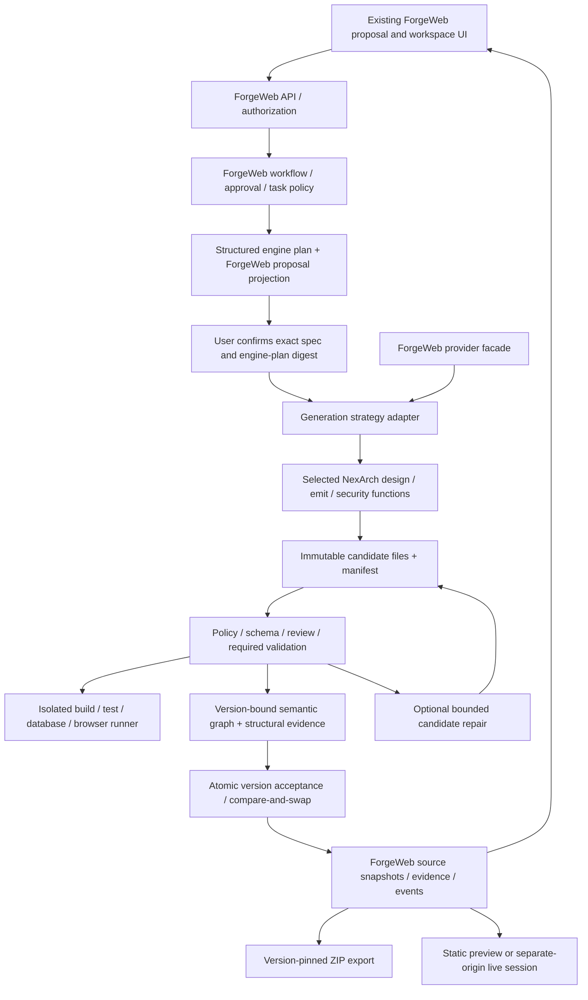

# NexArch Integration Plan

Latest implementation status: [Phase 3.6 safety gates](NEXARCH_PHASE3_6_SAFETY_GATES.md). PostgreSQL is canonical; MySQL planning cannot be approved for application generation. Durable plan records, default-denied owner verification, layout protection and candidate/validation contracts are implemented. Actual auth, PostgreSQL engine support, execution and acceptance remain unavailable. Earlier phase sections below retain their historical decisions.

Checkpoint scope: **ForgeWeb integration baseline containing pre-existing ForgeWeb generation/product foundation work plus NexArch Phases 1–3.6 integration and safety-gate work.**

## Phase 3.5 gate decision (2026-10-05)

The callable Phase 3 planner is **not** a live BuildWorkflow strategy. Its `PlanningRequest.databaseDialect` is now mandatory and the NexArch adapter accepts only `mysql8` together with `nexarch-mysql8-planning-v1`. `DatabaseDesign.dialect` also identifies MySQL 8. ForgeWeb's current proposal says PostgreSQL while its generated backend uses in-memory Maps; neither path is a validated MySQL application. Do not relabel the design, pass it to the legacy generator, or provision a database. A later PostgreSQL profile needs genuine type/default/enum/FK/index/SQL/Prisma adaptation and disposable-database tests; a MySQL application profile needs an independently approved generated-runtime design and tests.

Reuse ForgeWeb's existing `awaiting_confirmation` / `confirm` authority, but do **not** wire this planner to `confirm()` yet: confirmation currently immediately calls the legacy source generator. The smallest safe future mapping is a ForgeWeb-owned, build-scoped immutable planning artifact (project/build/operation/actor context, explicit dialect/profile, engine revision, normalized proposal, plan/database digests, base-version reference). It must be presented with the proposal; a revision creates a new artifact; confirmation binds the exact artifact digest to an approved specification. Only a separately gated future generation request may consume that approval. Keep artifact storage in ForgeWeb's `JsonStore` or a ForgeWeb-owned replacement, not NexArch persistence. This mapping is a decision, **not an implemented persistence migration**; no new schema, UI or API has been introduced in Phase 3.5.

Planning artifacts are proposals, not `CandidateArtifacts` and not accepted `ProjectVersion` records. The existing accepted version/file snapshot remains immutable. Future candidates require distinct IDs/base digests and ForgeWeb validation before acceptance. The implementation stays off the production path until target database choice, owner authorization, durable artifact binding, new-layout compatibility protection, and isolated generated-code validation are proved. Source use, modification, adaptation, and integration into ForgeWeb are explicitly authorized by the original NexArch author; this is not a claim that NexArch is open source or that broader rights exist. The deterministic planner has no provider call; any future provider is injected server-side through ForgeWeb's authority, with explicit failures and no browser secrets. No Phase 4 generator is enabled by this decision.

Date: 2026-10-05. Proposed architecture and migration only. No implementation, dependency installation, schema migration or source extraction is authorized or performed by this audit.

Read with the [audit](NEXARCH_INTEGRATION_AUDIT.md), [module mapping](NEXARCH_MODULE_MAPPING.md), and [risk register](NEXARCH_MIGRATION_RISKS.md).

## Architecture Decision

Use a ForgeWeb-owned generation strategy adapter, initially in-process for pure planning/emission. Keep the existing native HTTP server, UI and JSON persistence while proving the boundary. Expensive or untrusted execution goes through an isolated worker port, not a second NexArch platform. A future queue/database migration can implement these ports independently; it is not a prerequisite for the initial local, serial, non-executing spike.

The engine may propose design and candidate artifacts. It may not create canonical projects, approve specifications, change owner identity, write accepted files, advance ForgeWeb Build status, install dependencies on the control-plane host, or publish/export an application.

This graph describes proposed components, not deployed infrastructure. ForgeWeb's present structural graph is not a working CRG parser; preserve the eventual CRG adapter boundary without claiming it is already installed.

## Boundary Contract

Implement runtime schemas, not just TypeScript interfaces. Keep NexArch types private; the exact proposed files are in the mapping document.

| Input | Rule |
|---|---|
| Principal and scope | Server-derived actor/tenant/project authorization context; never trust body-supplied owner IDs. |
| Canonical identity | ForgeWeb projectId, buildId, specificationId, operationId, attemptId and optional immutable baseVersionId. |
| Approved intent | Frozen specification, requirement IDs, engine plan and digests. A model cannot replace these. |
| Target profile | Explicit engine revision, adapter/schema versions, framework/runtime/database/auth decisions, dependency policy and layout. |
| Base artifacts | Version-pinned manifest and files, graph snapshot and validation evidence, or an empty initial base. |
| Policy | Role, allowed/forbidden paths, file/line/token/time limits, sensitive-change restrictions and required check IDs. |
| Services | Injected provider, read-only artifact resolver, logger/redactor, clock and cancellation; isolated runner only when explicitly requested by workflow. |

| Output | Acceptance condition |
|---|---|
| Candidate files | Normalized relative paths, content, area/language, requirement mappings, provenance and final digests; never canonical writes. |
| Typed artifacts | Requirements projection, structured design, database/OpenAPI, route/feature manifest, findings and graph draft. Schema/version/digest identified. |
| Change set | Adds/modifies/deletes with base hashes, affected requirements, explicit conflicts and review-needed changes. |
| Execution evidence | Actual commands/checks, exit codes, runner image/dependency-lock/source digests, timestamps and redacted logs. Separate from model opinions. |
| Progress and usage | Internal stage/attempt records mapped to existing ForgeWeb events; per-call provider/model/tokens/fallback and aggregate usage. |
| Outcome | Candidate, needs clarification/reapproval, blocked, cancelled or failed. Only ForgeWeb decides accepted/completed. |

Planning and emission are separate calls. Analysis/architecture/database *design metadata* may enrich the proposal before confirmation. Source emission, package generation and execution cannot start until confirmation. If a later schema, endpoint, role, authentication requirement, target stack or dependency decision differs materially from approved intent, stop and revise the proposal; do not silently update the confirmed architecture.

## Target Profiles and Compatibility

Retain a `forgeweb-legacy-v1` profile for existing source snapshots and template behavior. Proposed new profile: `forgeweb-nexarch-react-express-postgres-v1`, aligned with ForgeWeb's stated database direction but **not currently implemented**. It requires a tested PostgreSQL dialect adaptation across SQL, Prisma native types, relationships, defaults, enums, metadata and provisioning. NexArch's current MySQL emitters cannot simply be relabeled.

An explicitly approved experimental MySQL profile is a possible alternative to the PostgreSQL adaptation, not the default and not a silent fallback. Product/architecture owners must approve the first target before implementation.

The profile declares entry points, package boundaries, commands, health path, schema path, dependency lock, file budget, auth mode and preview strategy. It distinguishes ForgeWeb's current single root generated package and `/health` backend from NexArch's separate frontend/backend packages and `/api/v1/health`. Do not rewrite upstream files into the legacy layout merely to satisfy substring checks.

Before the first new-profile write:

1. Select validation/compatibility by stored profile, not presence of a default App marker.
2. Bypass legacy auto-upgrade for explicitly identified new profiles; preserve legacy behavior only for known legacy versions.
3. Reject unknown profiles read-only with a clear compatibility error; never regenerate them on workspace GET.
4. Store engine/profile/adapter versions in each accepted version's internal manifest.
5. Keep existing API projections stable and legacy projects usable. Review any root export package change as part of the generated profile, not the ForgeWeb platform manifest.

Keep `.env` and `.env.*` forbidden under current artifact policy. Translate upstream `.env.example` into non-secret configuration instructions in an allowed README and structured runtime configuration metadata. Inject session-only values in the sandbox through a distinct trusted runner channel. Do not let ordinary generated artifacts write those environment files or include real secrets in ZIPs.

NexArch can exceed ForgeWeb's current 40-file task budget. Compute the manifest before execution and approve a realistic profile/task budget, preferably split into bounded tasks. No global unlimited budget, silent truncation or synthetic requirement links for every file.

## Identity and Ownership

| Identifier | Proposed mapping |
|---|---|
| Project | Preserve the existing opaque ForgeWeb `project_...` ID exactly. Names/slugs are display data, never unique keys. |
| Specification | Preserve specification ID and its approval digest. Current numeric spec versions alone are not sufficient global identity. |
| Requirement | Namespace by project/spec ID and preserve ForgeWeb requirement IDs. Maintain explicit one-to-many links to engine modules/entities/endpoints/files. Disambiguate same-name features. |
| Build | Existing ForgeWeb build ID stays the public operation identity. Generation/edit/repair attempts can be child operations without overwriting earlier build artifacts. |
| Engine run/attempt | ForgeWeb allocates distinct internal IDs, parented to project/build/base version. Do not create a NexArch Project row or expose its UUID/cuid lifecycle. |
| Artifact | Typed, immutable identity plus digest and project/spec/run/attempt/base-version provenance. No lookup by latest project-name/type. |
| Version and graph | One accepted file manifest, validation policy/evidence and graph snapshot reference per version. Restore selects the matching derived state. |
| Preview/database session | Opaque unique session ID derived independently of project name; exact project/version/owner scope and expiry. |

Current ForgeWeb has no authenticated principal or project ownership field. Production multi-user integration cannot pretend to map to nonexistent identity. Introduce ForgeWeb-owned server authentication/membership in a separately authorized phase, with a safe explicit ownership assignment for existing local projects; do not assign them to the first remote visitor or auto-create NexArch's local ADMIN user.

For an initial local-only spike, an explicit development identity can represent the trusted operator, with no remote exposure or multi-tenancy claim. Before hosted use, authorize every project/build/event/file/artifact/graph/context/version/export/runner access server-side, including run-to-project and version-to-project association. IDs are not bearer credentials. Do not forward ForgeWeb sessions or provider keys to generated apps. Their users, passwords, roles and JWT/session keys belong to the generated application's independent identity system.

## Artifact Flow and Atomic Acceptance

1. Read and authorize the approved specification, base version and target profile. Acquire a project operation lease and record the expected current version.
2. Resolve inputs by immutable ID/digest. Validate the engine plan and requirement map; record prompt/provider/engine/profile/policy versions.
3. Produce architecture/database/API artifacts from the approved design, then backend and frontend candidates. Frontend uses the backend's implemented route manifest, not optimistic architecture alone.
4. Apply security overlays in a declared order to an allowlisted set of collisions. Unexpected duplicate paths, case-fold collisions, or incompatible dependency changes fail the candidate.
5. Normalize prefixes exactly once (`frontend/`, `backend/`, `tests/`), reject absolute/drive/UNC/traversal/reserved paths, compute hashes after overlays, enforce size/change budgets and complete traceability.
6. Stage candidate artifacts outside accepted source. In the local spike this may be bounded ephemeral state; restart makes the operation interrupted, not successful. Before resumable use, persist candidate/checkpoint manifests through ForgeWeb storage.
7. Perform independent review and all required checks. Persist failed evidence too; never manufacture pass results from a generated test file or report flag.
8. Construct/validate the graph from the same final candidate digest and check evidence. If required graph invariants fail, do not accept.
9. In one ForgeWeb acceptance operation, verify lease/current-version compare-and-swap, persist versionFiles/manifest/evidence/graph and update project/build pointers. Publish completion events only after commit. If storage is external later, upload immutable blobs first and transactionally commit references; clean orphan candidates asynchronously.
10. Workspace, database panel, preview and export resolve that accepted version. ZIP validation and packaging pin the same immutable version rather than rereading a moving current pointer.

Do not reuse ForgeWeb's current early `database.files` update as the acceptance point. It must become candidate staging for the new strategy. Do not let an upstream artifact store or graph repository become a second writer.

A future additive persistence revision may be needed for manifests, profiles, ownership, attempts and graph/evidence links. Its format and migration must be approved in an implementation task. This audit changes no schema. JSON-store support is acceptable for a serial local prototype; multi-process operation requires a real coordinated durable store/queue, not an assumption that file rename is a distributed transaction.

## Validation

Mandatory gates for a new executable profile:

| Gate | What must be demonstrated |
|---|---|
| Input and approval | Exact approved spec/plan/profile/policy digest; no new unapproved scope/auth/dialect decisions. |
| Artifact integrity | Runtime schemas, required artifacts, path containment, UTF/content and byte/file budgets, no forbidden files/secrets, exact dependency allowlist/lock. |
| Traceability | Every product source change tied to approved requirements; support files classified honestly; P0 coverage refers to implementing code, not arbitrary IDs. |
| Static review | API/DB/schema consistency, implemented route checks, dependency and security findings; independent reviewer cannot self-approve implementation. |
| Build | Real generated backend/frontend typecheck and production build in pinned isolated environment, including Prisma validation/client generation for the chosen dialect. |
| Tests | Meaningful unit/integration tests tied to acceptance criteria; no pass based only on test-file presence or nonempty requirement array. |
| API/database | Real route methods/status/payloads, validation/errors, CRUD durability and relationships against disposable DB; no destructive customer migration. |
| Authentication/authorization | When required: valid/invalid credentials, session expiry, deny-by-default roles, cross-user record access, forged role headers, CSRF where relevant. Public-app policy must be explicit. |
| Browser | Actual UI render, navigation/forms/error/loading/empty states, responsive layout and frontend/backend interaction; screenshots and console/network evidence. |
| Graph | No unresolved required links, correct requirement identities, source/check/manifest version agreement; partial/heuristic evidence labeled. |
| Export | Safe ZIP paths, no platform assets/secrets, source/profile/licenses/config instructions, same validated version digest. |

Translate upstream PASS to passed and FAIL to failed. Preserve SKIPPED/BLOCKED and their reasons in internal evidence; a required check in either state blocks acceptance. While the public contract only permits passed/failed/skipped, emit a failed required-gate check with a precise blocked reason rather than inventing a new wire enum or claiming success. Optional checks may be skipped only with policy-defined applicability.

The upstream agent run status and validation summary are inputs, not authority. An agent finishing without throwing does not prove its output works. Model confidence, source regex checks and security resolution flags cannot satisfy runtime gates.

No generated commands run on the ForgeWeb API host. A minimal runner must provide nonprivileged disposable isolation, no host mounts/container socket, CPU/memory/PID/disk/time/log quotas, process-tree termination, denied metadata/control-plane network access, scoped egress, ephemeral credentials and teardown. Dependency fetching/build scripts execute there under a pinned policy; shell=false and environment filtering alone do not meet this requirement.

## Preview Strategy

**Existing versions:** keep current static HTML route, script-disabled CSP and iframe sandbox. Preserve the Preview tab/device controls and avoid blanking existing projects.

**New-profile MVP:** retain a safe static projection or a sandbox-produced sanitized screenshot/HTML preview that is explicitly linked to the accepted version. It is not evidence that app interactions work. Until a live runner is approved, do not weaken the existing same-origin CSP or present localhost runner URLs as hosted previews. Ensure the profile has a defined static artifact so the existing tab remains usable.

**Live phase:** materialize a pinned accepted snapshot in an isolated runner with a disposable, per-session database and approved dependency lock. Serve through a separate preview origin and authenticated, short-lived session gateway. Validate project/version ownership at session creation and access; scope cookies/tokens, prevent cross-origin credential leakage, restrict navigation/popups/downloads and proxy backend traffic within the session. Use only the sandbox permissions the app requires, never same-origin script privileges on the ForgeWeb origin.

The ForgeWeb UI may later need a small version/mode-aware iframe/session hook and loading/error handling, but no redesign or NexArch runner dashboard. Restore/edit invalidates the old current-preview pointer; a pinned older session must remain clearly bound to its old version or be stopped. Cleanup is mandatory on expiry, cancel, error and restart.

## Engineering Graph and Context

Use three explicit layers:

1. Approved ForgeWeb intent: project/spec/requirements/roles/policies/tasks/acceptance evidence.
2. NexArch-derived semantic relationships: features/components/APIs/services/entities/fields/security/dependencies/findings.
3. Structural code evidence: initially honest heuristic dependency results, eventually ForgeWeb's separately approved CRG adapter. Never substitute metadata for parser/test evidence.

Use project-qualified stable IDs and exact file paths/digests. Create all nodes first, then resolve edges; unresolved required references are errors. Record engine revision, source artifact ID/digest, version, spec and derivation method. Map edge directions explicitly. A generated TEST node is not a test execution; validated-by links require an actual passing check and its subject paths/criteria.

Persist graph snapshots with the accepted source version. Initial generation, incremental edit, repair and restore must all keep graph/version/evidence consistent. A restored snapshot selects its own graph or blocks authoritative claims until rebuilt from exactly that snapshot; never show the latest project's graph against older files.

Context reads only authorized immutable artifacts of that operation. Verify principal -> project -> run -> version associations before any lookup/cache hit. Cache key includes tenant/project, spec/base/candidate/graph digests, task scope, schema/prompt versions, provider/model and token budget. Never combine a graph from one version with legacy pipeline artifacts from another run. Missing required context yields a blocked task; incomplete graph coverage broadens context conservatively. Sanitize secrets/untrusted instructions and retain source provenance; sanitization is not a guarantee against prompt injection.

## Incremental Regeneration

1. Pin current version and the spec revision. Classify the request as source-only refinement versus scope/schema/API/security change requiring revised approval.
2. Diff approved structured plans and source manifests; traverse dependency and semantic graphs for affected code, contracts, tests and data. Unknown/dynamic dependencies expand scope and validation.
3. Produce bounded task scopes; serialize writers of shared schemas, routes, auth, dependencies and global config. Initially use one writer per project.
4. Regenerate only authorized candidate outputs against the same base. Review changes against base and current accepted/manual content using a three-way merge; do not treat upstream `merge-engine.ts` as a conflict detector.
5. Preserve user edits. Conflicting edits, deleted-but-modified files, renamed entities, stale base versions and out-of-scope new files require review/rebase. Deletion is explicit and policy-approved; the current default maxDeletedLines=0 cannot be silently bypassed.
6. Rebuild affected derived artifacts and all required acceptance checks. Validate shared contracts/security/database changes broadly even if a graph reports a small impact.
7. Atomically accept one new version with the exact graph/evidence; a failed/stale candidate cannot replace current source.

Do not permanently retain removed files just because the upstream merge does, and do not auto-accept all new files. Compare-and-swap prevents concurrent edit/restore/regeneration from losing accepted work. Revision/retry idempotency keys include project, operation, base version, approved spec and engine/profile revision.

## Self-Repair

Introduce after deterministic generation, isolated validation, snapshot acceptance and graph consistency are reliable.

- Detect a concrete finding from real evidence; classify mechanical repair versus review-required product/auth/schema/dependency changes.
- Freeze base candidate, task policy and protected tests. Model output is an untrusted patch proposal with exact paths/base hashes, not shell commands.
- Default to at most two attempts per finding and three repair rounds per operation, with explicit total file/line/time/token limits consistent with ForgeWeb policy. Upstream defaults are references, not automatically adopted configuration.
- Apply to an isolated overlay; rerun targeted checks and the full mandatory acceptance suite, including all previously passing baseline checks even when a targeted check shares their kind.
- Reject changes to tests merely to make them pass, removal of authorization, dependency changes, destructive migrations and expanded scope without separate approval.
- On failed checks, exception, timeout, cancellation, stale base or storage error, discard the candidate in a finally-safe cleanup path. Accepted source was never modified, so exception rollback cannot be skipped.
- Detect repeated finding/patch loops, persist attempts and usage, enforce hard deadlines on individual operations, and stop for user review when limits are reached.
- Run repair as nested attempts within the ForgeWeb operation/stage, not an illegal backward Build-status transition. Only final independently validated acceptance can advance to completed.

A previously accepted app remains usable when a repair fails. Never mark a finding fixed solely because an upstream strategy produced edits or graph sync ran.

## Migration Order and Gates

| Phase | Work, in order | Exit gate / rollback |
|---|---|---|
| 0. Permission and baseline | Record the original author's explicit authorization to use, modify, adapt, and integrate NexArch into ForgeWeb; agree the combined checkpoint baseline; approve target dialect/auth/profile and dependency policy | Integration reuse authorization recorded without asserting an open-source license. No reset/stash of existing work. |
| 1. Contract spike | Add approved boundary/profile fixtures and a legacy wrapper; snapshot current API/UI/versions; prove path/requirement/status mapping | Legacy behavior unchanged, no new engine writes, no dependency/schema change unless separately approved. |
| 2. Compatibility and acceptance | Profile-aware legacy upgrade guard, pinned preview/export/restore, candidate staging, operation lease/CAS, version/evidence manifest | Fault/concurrency tests prove old versions untouched; bridge release reads legacy and proposed new metadata. |
| 3. Planning in shadow | Authorized analysis/architecture/database design adapters plus provider bridge; compare proposals without accepting generated code | Structured plan projects into existing proposal; explicit auth/dialect; no source before confirmation. |
| 4. Deterministic generation | Backend/frontend/security composition; target layout/dependency locking/PostgreSQL adaptation; generate candidates only | Overlay, schema, requirement and package fixtures pass; no active project promotion yet. |
| 5. Isolated validation | Secure worker/database provisioning, real build/tests/auth/API/browser evidence; ForgeWeb ownership before multi-user exposure | Required checks pass on representative apps; hostile-code isolation/security review; blocked checks cannot accept. |
| 6. Semantic graph and context | Correct identities/forward links/provenance, immutable resolver/cache and graph/version acceptance | Exact graph/evidence/source agreement, cross-project/run negative tests, no fake CRG evidence. |
| 7. Opt-in generation | Enable new profile only for explicit new-project cohort; keep legacy path; expose existing workspace projections | Complete build/edit/restore/export experience and legacy UI regression tests pass; observe failures/costs. |
| 8. Incremental edits | Impact planning, three-way merge, explicit deletion/conflicts, broad regression gates | Manual-edit retention and concurrent operation tests; rollback preserves current version. |
| 9. Live preview | Signed separate-origin session gateway and minimal existing Preview tab hook | Isolation, ownership, expiry, responsive interactions and teardown verified. Can remain disabled independently. |
| 10. Repair | Candidate-only bounded repair with exception/cancel regression tests | Protected policy/tests unchanged; no failing candidate promoted; manual-review exit demonstrated. |
| 11. Expansion | Increase supported domain/profile cohort based on measured acceptance/latency/cost/reliability | Separate decision for durable distributed infrastructure and additional frameworks/dialects. |

Phases 5-6 must complete before phase 7 production acceptance; phases 9-10 are independent feature gates and are not required to read/export an accepted project. A local shadow spike is not a production release. No existing project is silently converted to the new profile.

## Rollback Strategy

Use proposed flags for engine selection and separate graph/context/live-preview/repair enablement, all new capabilities off by default. Pin selection per operation/version so a mid-run flag change cannot mix engines.

1. Stop new affected operations, cancel workers and preserve redacted diagnostics; accepted versions remain readable.
2. Discard/quarantine unaccepted candidates; release leases and destroy ephemeral sessions/databases. Do not run destructive commands against customer databases.
3. Keep new-profile versions read-only/exportable using the compatibility bridge. Disable regeneration of those versions if their engine is unavailable. Never feed them into legacy auto-upgrade as a fallback.
4. Legacy-profile projects continue through the legacy engine. A deliberate profile conversion is a new reviewed operation, not rollback.
5. Restore project pointers only to a validated same-project version with matching graph/evidence. Rollback is pointer selection, not deletion of version history.
6. If a persistence revision is introduced, keep a tested reader/writer compatibility release and backups. Do not launch the original schema-v2 binary against unknown newer schema data. Down-migration requires an explicit tested procedure; no automatic data-loss rollback.
7. External production app databases need their own reviewed migration/backup rollback. Rolling back source does not reverse a database schema or data change.

Rehearse rollback with in-flight builds, unavailable providers, worker crashes, failed checks, expired preview sessions, and mixed legacy/new-profile projects before enabling a cohort.

## Testing Strategy

The audit inspected test source but ran no application tests. The following is a future acceptance program, not a report of passing results.

| Layer | Required tests |
|---|---|
| Characterization | Existing `server/tests/app.test.ts`, `workflow.test.ts`, `security.test.ts`, `llm-mode.test.ts`, `env.test.ts`, and `scripts/api-e2e.mjs` behavior; preserve current dirty-worktree expectations. |
| Boundary | Round-trip existing wire contracts; absent/unknown fields, huge payloads, invalid IDs, unsupported profiles, path traversal/absolute Windows paths/UNC/case collisions/reserved names and secret files. |
| Deterministic fixtures | Public and authenticated CRUD, multiple roles, related entities, enums, optional/unique fields, duplicate names, custom unimplemented endpoint, empty result states; normalized timestamps for comparisons. |
| Generated project | Resolve pinned target dependencies inside isolation; actual compile/build/test, PostgreSQL schema/CRUD relations, auth/ownership and frontend/backend browser flows. |
| Provider | Ollama and compatible mocks; unavailable/timeout/rate-limit/invalid JSON/invalid schema/cache mismatch/budget exhaustion; truthful fallback/usage and credential redaction. |
| Graph/context | Forward references, cycles, entity/table aliases, same labels across projects, edge direction, deleted files, missing artifacts, stale graph, mixed run/project and tenant-isolated cache. |
| Incremental | Manual edits survive, explicit conflicts/deletions, out-of-scope additions rejected, restore/edit races, shared schema broad checks, stale-base rejection. |
| Repair | Real failure fixed; no-op/harmful patch rejected; validator throws after patch, cancel/timeout, repeated loop, budget cap, dependency/test/security weakening denied, full baseline regression. |
| Persistence | Crash at each candidate/check/acceptance boundary, duplicate retry, restart, competing writer, failed commit/event publication, backup/bridge migration and restore. |
| Isolation | Attempts to access host files/metadata/control secrets, outbound abuse, fork/disk/log exhaustion, unsafe package lifecycle scripts, cross-session DB access and cleanup failure. |
| UI/end-to-end | Existing proposal confirm/revise, progress, Files/Preview/Database/Versions, edit/restore/export and mobile/desktop screenshots; live preview only in later phase. |

Record commands, environment, revision and outcomes when tests are actually run. Deleted pre-existing UI audit scripts must not be resurrected or reported as available; establish a maintained browser regression harness in a separately authorized phase.

## Decisions Still Required

- Rights beyond the original author's stated permission to use, modify, adapt, and integrate NexArch into ForgeWeb, if a future release requires them; do not infer an open-source license or broader redistribution grant.
- First generated target: recommended PostgreSQL adaptation versus explicitly approved experimental MySQL; real auth expectations.
- Checkpoint the agreed combined baseline: pre-existing ForgeWeb generation/product foundation plus NexArch Phases 1–3.6 integration and safety-gate work.
- ForgeWeb hosted identity/ownership design and safe handling of legacy local projects.
- Runner infrastructure, network policy, preview origin, dependency registry/lock policy and operational budgets.
- Approved additive persistence/manifest contract before accepting non-legacy versions.

Phase 0 authorization and the Phase 1 audit are complete. Phase 4 remains outside this document correction and requires explicit instruction after the remaining technical gates are accepted; do not expand the selected NexArch source set by default.
